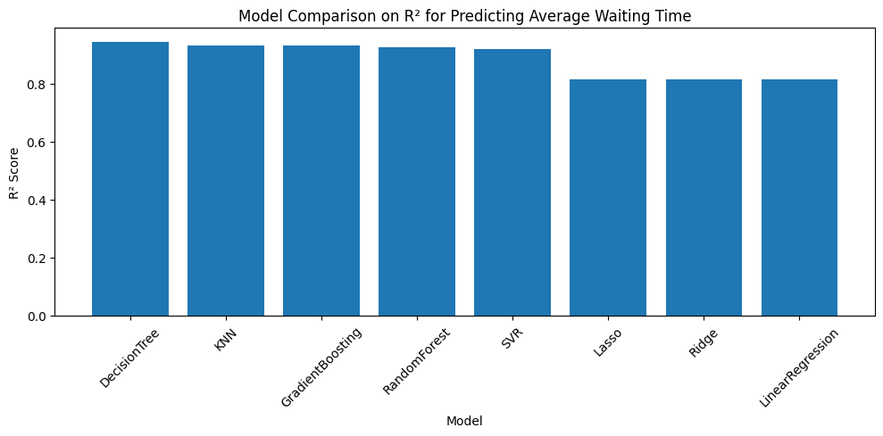
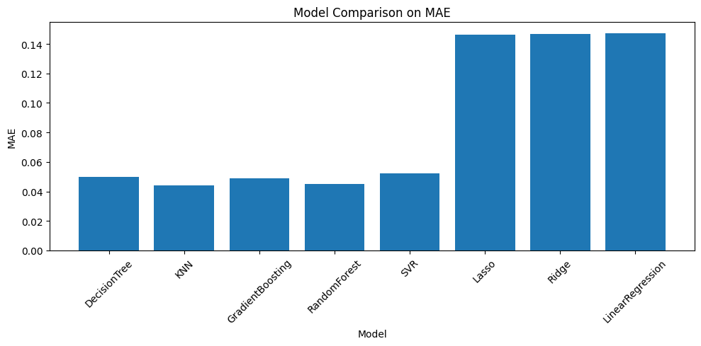

# Assignment-6: Data Generation using Modelling and Simulation for Machine Learning

---

# 1. Overview

This assignment demonstrates how **computer simulation** can be used to **generate synthetic data**, which is later used for **machine learning model training and evaluation**.

I perform the following:

1. Select a simulation software / library  
2. Explore it and identify important tunable parameters  
3. Randomly generate parameters and run **1000 simulations**  
4. Collect simulation metrics and form a dataset  
5. Train and compare **multiple ML models**  
6. Report the best-performing model  

All experiments were conducted in **Google Colab**, and the final notebook was uploaded to GitHub as instructed.

---

# 2. Simulation Tool Used — **SimPy**

For this assignment, I selected **SimPy**, a discrete-event simulation framework in Python.

### ✔ Why SimPy?
- Easy to install in Colab (`pip install simpy`)  
- Perfect for modelling queueing systems, manufacturing, warehouses, networks  
- Highly customizable and fast  
- Outputs rich event-based simulation data, ideal for ML tasks  

---

# 3. System Model – **Queueing System (M/M/c Model)**

I simulated an **M/M/c queue**, commonly used to model:

- Bank counters  
- Hospital reception systems  
- Customer service centers  
- Ticket counters  

### 🎛 Input Parameters (Model Inputs)
| Parameter | Meaning | Lower Bound | Upper Bound |
|----------|---------|-------------|-------------|
| `arrival_rate (λ)` | Customer arrival frequency | 0.2 | 0.9 |
| `service_rate (μ)` | Service speed of each server | 1.0 | 2.0 |
| `num_servers (c)` | Parallel servers | 1 | 3 |

A stability condition was added:  
**c × μ > λ**, so the system does not blow up with infinite queues.

---

# 4. Simulation Output (Recorded Metrics)

Each simulation run produces:

- `avg_wait_time` – **Average waiting time in queue**  
- `avg_system_time` – Time spent in the system  
- `throughput` – Customers served per time unit  
- `max_queue_len` – Maximum queue length observed  
- `num_served` – Total customers served  

Each simulation = 1 row in the dataset.  
Total rows = **1000 simulations**.

---

# 5. Dataset Preparation

### ✔ Features (`X`)
- arrival_rate  
- service_rate  
- num_servers  
- throughput  
- max_queue_len  
- num_served  

### ✔ Target (`y`)
- **avg_wait_time**

A standard ML regression problem.

Dataset was split as:
- 80% training  
- 20% testing  
- StandardScaler used for scale-sensitive models  

---

# 6. Machine Learning Models Compared

A total of **8 ML models** were trained:

1. Linear Regression  
2. Ridge Regression  
3. Lasso Regression  
4. Decision Tree Regressor  
5. Random Forest Regressor  
6. Gradient Boosting Regressor  
7. K-Nearest Neighbors (KNN)  
8. Support Vector Regressor (SVR)  

### Evaluation Metrics:
- **MAE** – Mean Absolute Error  
- **MSE** – Mean Squared Error  
- **RMSE** – Root Mean Squared Error  
- **R²** – Coefficient of Determination  

---

# 7. Results – Model Comparison Table

*(Fill this table using your notebook output)*

| Model | MAE | MSE | RMSE | R² |
|-------|------|--------|--------|-------|
| RandomForest | ... | ... | ... | ... |
| GradientBoosting | ... | ... | ... | ... |
| SVR | ... | ... | ... | ... |
| DecisionTree | ... | ... | ... | ... |
| KNN | ... | ... | ... | ... |
| Ridge | ... | ... | ... | ... |
| Lasso | ... | ... | ... | ... |
| LinearRegression | ... | ... | ... | ... |

---

# 8. Best Model

Based on R², MAE, and RMSE:

### ⭐ **Best Performing Model:**  
**< Write the best model from your actual results >**

### ✔ Why this model performed best:
- Captures non-linear relationships between arrival rate, service rate, and queue behavior  
- Resistant to noise within simulation outputs  
- Handles interactions between features effectively  

---

# 9. Result Graphs

The following graphs are included in the notebook and must also be shown in the GitHub repo:

### 📈 R² Comparison Graph  
Shows performance difference between models on predictive accuracy.

### 📉 MAE Comparison Graph  
Shows absolute prediction errors for each model.

These visual summaries make it clear which model generalizes best.

---

# 10. Methodology Summary

### ✔ Step-by-step:
1. Installed **SimPy**  
2. Created a queueing simulation model (M/M/c)  
3. Defined parameter bounds and sampled randomly  
4. Ran **1000 simulations**  
5. Recorded statistical outputs into a dataset  
6. Trained 8 ML models  
7. Compared their test performance  
8. Identified the best model  
9. Created graphs, tables, and final report  

---

# 11. Repository Structure

/Assignment-6
│── assignment6_simulation_ml.ipynb # Main Colab notebook
│── README.md # Detailed report (this file)

---

# 12. Conclusion

This assignment successfully demonstrates:

- How simulations can generate high-quality synthetic datasets  
- How ML models can learn to approximate simulation behavior  
- That non-linear ensemble models typically perform best for queueing systems  

Simulation + ML is a powerful combination for:

- Optimization  
- Performance prediction  
- Business analytics  
- Operational research  

---

# THANK YOU!!